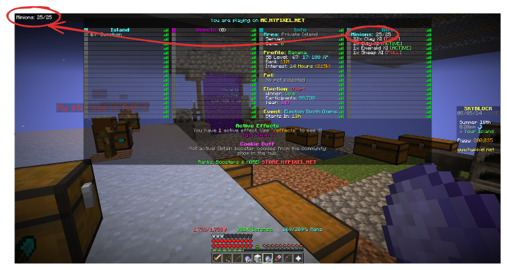

# Tab Grabber

A Minecraft HUD mod that aggregates information shown on the tab menu into an easily parseable format.
Using custom regex fully customisable by the user, this mod is able to show the parsed information as a HUD on screen.
This allows the user to not have to constantly press the tab key on servers if they want to constantly view information
shown on the tab menu.

**_NOTE:_** Even though scoreboards are also available on single player, for simplicity’s sake this mod will not support
that particular use case.



## Requirements

- [Fabric API](https://modrinth.com/mod/fabric-api)
- [Cloth Config](https://modrinth.com/mod/cloth-config)
- [Mod Menu](https://modrinth.com/mod/modmenu)

## Usage

This mod uses a custom format based on [regular expressions](https://en.wikipedia.org/wiki/Regular_expression) to show
useful information on screen.

Since this is a Java mod, the regex used must be compatible with the stock regex parser that comes with Java.

To omit unneeded information, capture groups are used to capture only certain parts of the tab menu.

It will use the first capture group in your regex, or match the entire raw tab info if there is a match but there are no
capture groups.

### More on tab information

In reality, what the mod is actually scraping is header and footer information sent from the server, together with the
scoreboard.
An example of a header can be something like "Welcome to Hypixel".

What scoreboard is shown is based on the objective set by the server owner.
For example, if health is set as an objective to be shown to the player, this mod is programmed to do that, replacing
the heart icons with a decimal.

To allow for easier parsing, this mod removes any styling and section symbols specified by the server, and also strips
whitespace.

Something known as a "formatter" is used to parse tab menu info and format it as a HUD.

**_NOTE:_**  Newlines in your formatter play a crucial role in determining what would be shown to the user.
If a line in your formatter fails to match anything on your tab, it will silently fail and skip over to the next line in
your formatter.
This can be exploited by the user if the server shows similar tab info on different minigames for example.

### Config options

Enter the config screen via the mod menu.

- Enable/disable HUD (you can also toggle this via a keybind)
- HUD position (in percentage)
- Text color
- Text background
- Text alignment
- Text shadow
- Server configuration

#### Server configuration

To allow for different information to be shown on different servers, this mod uses the server domain to determine if it
should show any HUD info.
If the server is mentioned in the server configuration section of the config, it will use its respective formatter to
parse the tab menu.
This allows for the user to conditionally apply different parsing/formatting rules to different servers.

### Debugging

To see what tab info your formatter needs to match, enter `/tabgrabberdebug` in the server you want the HUD to show up.
This will output the raw information the tab menu is showing to the user in real time.
This will be in the format `key: value` separated by newlines.
The keys `Header` and `Footer` are specially reserved for showing header and footer information.
They will always appear below the scoreboard info in order.

If there are no objectives, you might see the following when you run this command:

```dtd
Player1: null
Player2: null
```

This is normal, and you can ignore that if you don't particularly care about the scoreboard.

There will also be an action you can click on below the debug info to copy it to your clipboard.
This is particularly useful if the server uses any esoteric symbols or a resource pack to style the tab menu.

### Example

The server `abc` is notorious for not showing its timers in parkour courses.
This is what you can do to show the timer on your screen:

1. In the config screen, set `abc` as the domain and `def` as the formatter.

That's all you need to do!

If you are curious as to what the formatter is matching, here you go:

```dtd
ghi: jkl
mno: pqr
Header: stu
Footer: vwx
```
